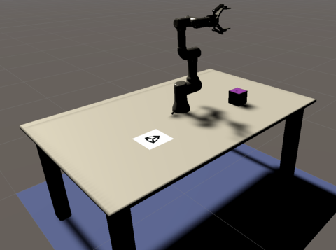
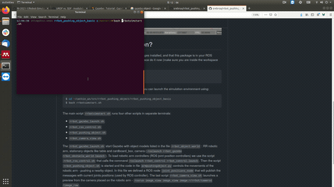

# Robot simulator

## 1. Goal
3D 시뮬레이터를 이용하여 물체 파지가 가능한 매니퓰레이터 환경 구축

1) 매니퓰레이터 1개 이상
2) 카메라 1개 이상
3) 테이블, 박스, 물체 등은 자유롭게 사용 가능

---
## 2. Example
### Gazebo


---

### Unity


---
## 3. Tutorial

### 3.1 Object
- [Building a world](http://gazebosim.org/tutorials?tut=build_world)

- [Make a model](http://gazebosim.org/tutorials?tut=build_model)

- [예제](https://github.com/srebroa/rrbot_pushing_object)

	


### 3.2 Robot

- Universal robot(UR)
	- [ROS](https://github.com/UniversalRobots/Universal_Robots_ROS_Driver)
		- 패키지 설치
		```
		# create a catkin workspace
		mkdir -p catkin_ws/src && cd catkin_ws

		# clone the driver
		git clone https://github.com/UniversalRobots/Universal_Robots_ROS_Driver.git src/Universal_Robots_ROS_Driver

		# clone fork of the description. This is currently necessary, until the changes are merged upstream.
		git clone -b calibration_devel https://github.com/fmauch/universal_robot.git src/fmauch_universal_robot

		# install dependencies
		sudo apt update -qq
		rosdep update
		rosdep install --from-paths src --ignore-src -y

		# build the workspace
		catkin_make

		# activate the workspace (ie: source it)
		source devel/setup.bash
		```
	- [Gazebo 예제](https://github.com/ros-industrial/universal_robot)
		- Usage with Gazebo Simulation

			`roslaunch ur_gazebo ur5.launch`
		- MoveIt! with a simulated robot

			`roslaunch ur5_moveit_config ur5_moveit_planning_execution.launch sim:=true`
		- For starting up RViz with a configuration including the MoveIt! Motion Planning plugin run:

			`roslaunch ur5_moveit_config moveit_rviz.launch config:=true`

---
### 3.3 Camera

TODO


## 4. 참고

- [Rviz](http://wiki.ros.org/rviz/): 3D 시각화 툴
	- 파일 형식
		- Unified Robot Description Format, ([URDF](http://wiki.ros.org/urdf))


----

- [Gazebo](http://gazebosim.org/tutorials): 3D 로봇 시뮬레이터
	- 파일 형식
		- Unified Robot Description Format, ([URDF](http://wiki.ros.org/urdf))
		- Simulation Description Format, ([SDF](http://sdformat.org/))
		- Semantic Robot Description Format, ([SRDF](http://wiki.ros.org/srdf))

- [URDF vs SDF](https://github.com/modulabs/gazebo-tutorial/wiki/URDF-vs.-SDF)

----
- [XML Macros, (Xacro)](http://wiki.ros.org/xacro): URDF는 링크와 관절의 연속적인 구조를 나타내기 위해 반복적인 구문이 많음. Xacro를 통해 이를 간소화.


- [MoveIt!](http://wiki.ros.org/moveit): 로봇 제어 패키지

- [Gazebo plugin(Camera)](http://gazebosim.org/tutorials?tut=ros_gzplugins): Gazebo에서 카메라 사용


----
